# ERCOT Energy Dashboard

A comprehensive real-time dashboard for monitoring Texas electricity grid data through the ERCOT (Electric Reliability Council of Texas) API. This application provides interactive visualizations, market insights, and AI-powered analysis of energy generation, demand, pricing, and distributed energy resources.

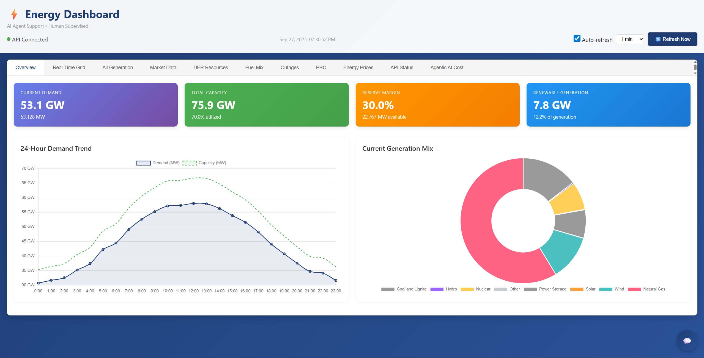

## Features

- **Real-time ERCOT data integration** with live API feeds
- **Interactive charts and visualizations** using Chart.js
- **AI-powered energy assistant** with GPT-5-nano integration
- **Multi-tab interface** for organized data exploration
- **Responsive design** optimized for desktop and mobile
- **Session history tracking** for AI conversations
- **Cost monitoring** for API usage and AI interactions

## Application Tabs

### 1. Overview Tab
The main dashboard providing a high-level view of the Texas electricity grid status.


**Key Features:**
- **Current System Demand**: Real-time electricity demand across ERCOT region
- **System Lambda**: Current marginal cost of electricity generation
- **Generation Mix**: Live breakdown of energy sources (natural gas, wind, solar, nuclear, etc.)
- **Real-time Pricing**: Current Settlement Point Prices (SPP) for major load zones
- **Quick Stats Cards**: Summary metrics for grid performance and market conditions

**Data Sources:**
- System-wide demand and generation data
- Real-time settlement point pricing
- Generation resource mix by fuel type
- System lambda (marginal pricing)

### 2. Real-Time Grid Tab
Live monitoring of grid operations and system conditions.

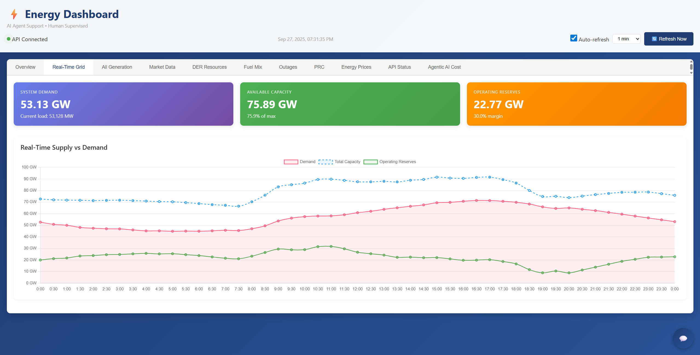

**Key Features:**
- **System Frequency**: Real-time grid frequency monitoring
- **Transmission Status**: Live transmission line and substation data
- **Emergency Procedures**: Grid emergency alerts and conservation notices
- **Interchange Flows**: Power flows between ERCOT and neighboring grids
- **System Inertia**: Grid stability and reliability metrics

**Data Sources:**
- Real-time system operational data
- Transmission system status
- Grid frequency measurements
- Emergency response protocols

### 3. All Generation Tab
Comprehensive view of electricity generation across all resource types.

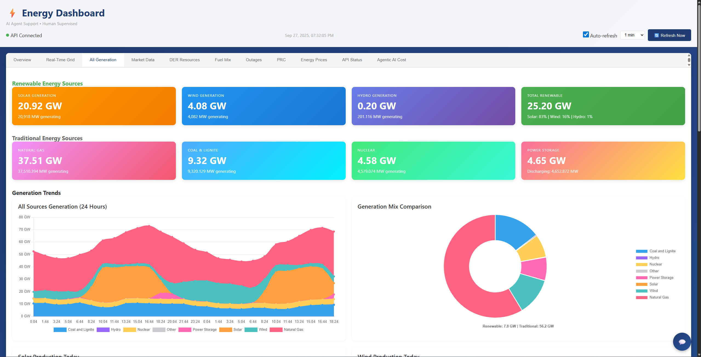

**Key Features:**
- **Generation by Fuel Type**: Real-time output from all generation sources
- **Capacity Factors**: Efficiency metrics for renewable resources
- **Generation Trends**: Historical patterns and forecasting
- **Resource Availability**: Online/offline status of major generation units
- **Environmental Impact**: Emissions tracking and renewable percentage

**Data Sources:**
- Real-time generation by resource type
- Historical generation patterns
- Generation resource outage schedules
- Renewable energy forecasts

### 4. Market Data Tab
Detailed market pricing and economic analysis of electricity markets.

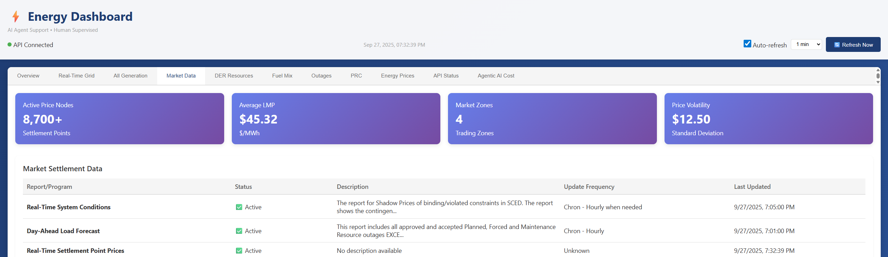

**Key Features:**
- **Hourly Price Charts**: 24-hour price trends for major trading hubs
- **Load Zone Comparison**: Price variations across different ERCOT load zones
- **Day-Ahead vs Real-Time**: Comparison of forecasted vs actual market prices
- **Price Volatility Indicators**: Market stress and price spike detection
- **Economic Dispatch Analysis**: Understanding of generation economics

**Data Sources:**
- Settlement Point Prices (SPP) for all load zones
- Day-ahead market clearing prices
- Real-time energy prices
- Ancillary services pricing

### 5. DER Resources Tab
Analysis of distributed energy resources including solar, wind, and storage systems.

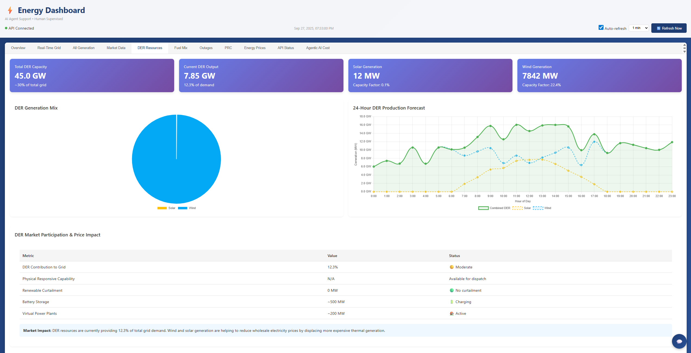

**Key Features:**
- **DER Mix Chart**: Breakdown of distributed energy resource types
- **Solar Production Tracking**: Real-time and forecasted solar generation
- **Wind Production Analysis**: Wind generation patterns and capacity factors
- **DER Forecast Charts**: 24-hour ahead predictions for renewable output
- **Grid Integration Metrics**: Impact of DER on grid stability and pricing

**Data Sources:**
- Distributed solar generation data
- Wind generation forecasts and actuals
- DER registration and capacity data
- Grid integration studies

### 6. Fuel Mix Tab
Detailed analysis of generation fuel sources and energy portfolio composition.

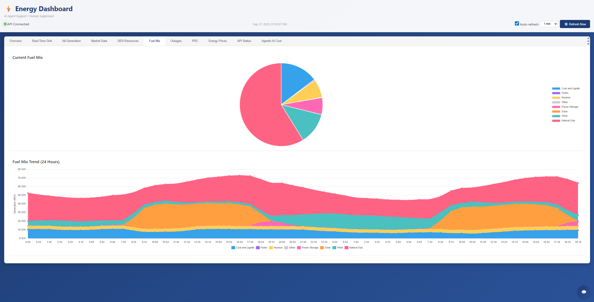

**Key Features:**
- **Fuel Source Breakdown**: Real-time percentage of each fuel type
- **Emissions Analysis**: Environmental impact by fuel source
- **Fuel Cost Trends**: Economic analysis of different generation sources
- **Carbon Intensity**: Grid carbon footprint tracking
- **Renewable Penetration**: Clean energy percentage and trends

**Data Sources:**
- Generation by fuel type data
- Fuel cost and availability data
- Environmental impact metrics
- Renewable energy certificates

### 7. Outages Tab
Comprehensive tracking of planned and unplanned generation outages.

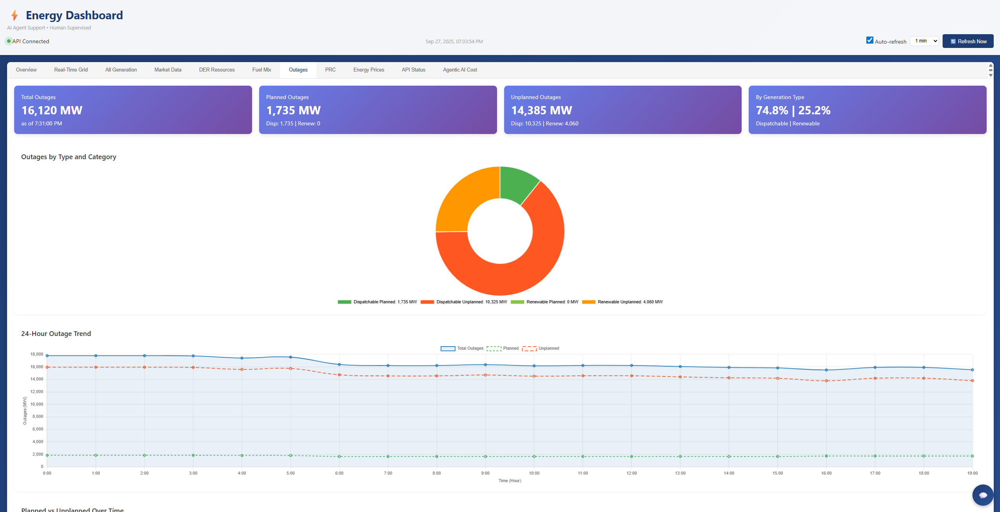

**Key Features:**
- **Current Outages**: Real-time status of offline generation units
- **Planned Maintenance**: Scheduled outages and maintenance windows
- **Forced Outages**: Unplanned outages and emergency shutdowns
- **Capacity Impact**: Available vs unavailable generation capacity
- **Outage Duration**: Historical outage patterns and recovery times

**Data Sources:**
- Generation resource outage schedules
- Forced outage reports
- Maintenance planning data
- Unit availability status

### 8. PRC (Physical Responsive Capability) Tab
Analysis of grid flexibility and responsive capacity resources.

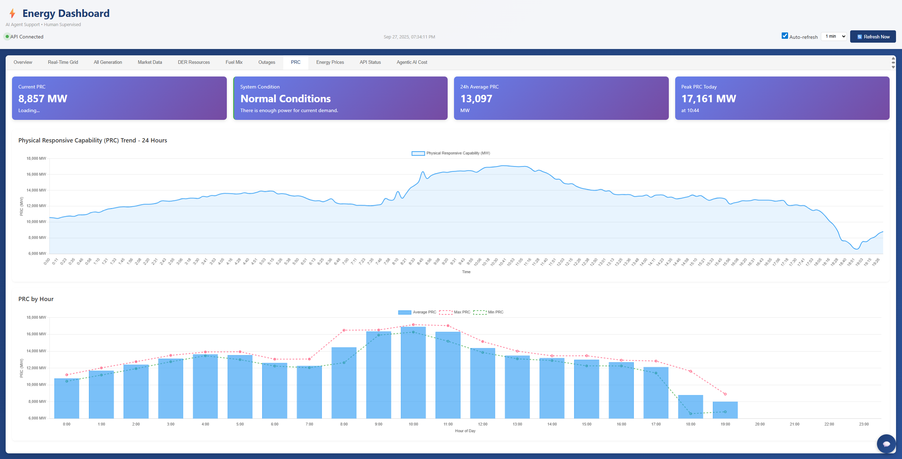

**Key Features:**
- **Responsive Reserve**: Available quick-response generation capacity
- **Load Response**: Demand response participation and availability
- **Regulation Services**: Frequency regulation capacity and deployment
- **Spinning Reserve**: Online backup generation capacity
- **Non-Spinning Reserve**: Offline but quickly available generation

**Data Sources:**
- Ancillary services market data
- Responsive reserve deployments
- Load response program participation
- Regulation service performance

### 9. Energy Prices Tab
Comprehensive energy pricing analysis across all market segments.

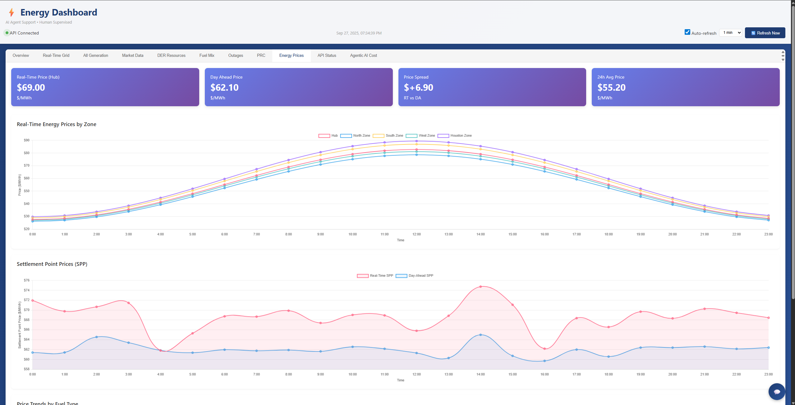

**Key Features:**
- **Real-Time Prices**: Current energy prices by settlement point
- **Historical Price Trends**: Long-term pricing patterns and analysis
- **Price Forecasting**: Predictive models for energy price movements
- **Congestion Analysis**: Transmission constraints and pricing impacts
- **Basis Differential**: Price spreads between different market locations

**Data Sources:**
- Settlement point pricing data
- Historical market clearing prices
- Transmission congestion data
- Load forecast and price correlation

### 10. API Status Tab
Real-time monitoring of ERCOT API endpoints and data feed health.

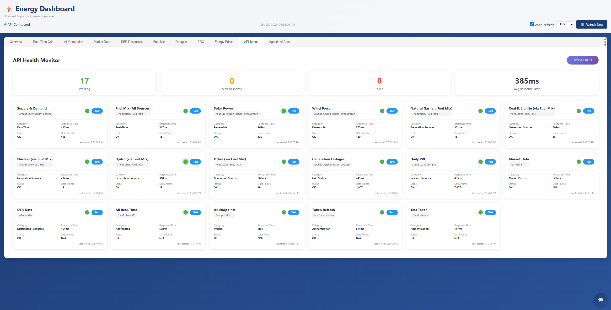

**Key Features:**
- **Endpoint Status**: Health monitoring of all ERCOT API services
- **Data Freshness**: Last update timestamps for each data feed
- **Response Times**: API performance and latency monitoring
- **Error Tracking**: Failed requests and connection issues
- **Service Availability**: Uptime statistics and reliability metrics

**Data Sources:**
- ERCOT API health checks
- Internal monitoring systems
- Response time measurements
- Error logging and tracking

### 11. Agentic AI Cost Tab
Monitoring and analysis of AI assistant usage and associated costs.

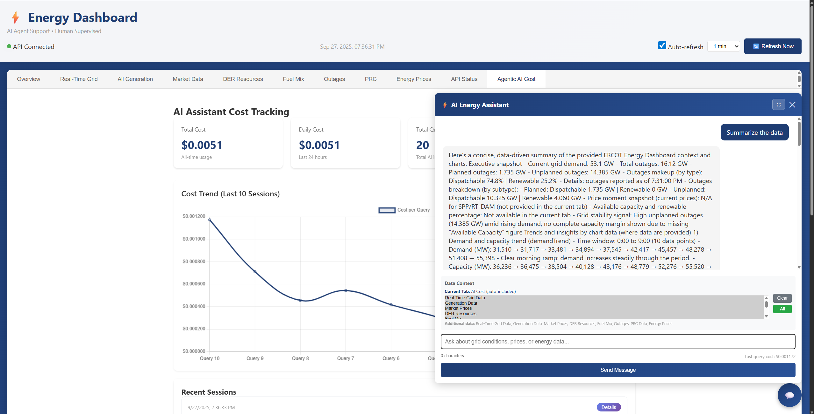

**Key Features:**
- **Usage Analytics**: Token consumption and API call statistics
- **Cost Breakdown**: Detailed cost analysis per conversation and query type
- **Session History**: Complete conversation logs with cost tracking
- **Usage Trends**: AI assistant utilization patterns over time
- **Cost Optimization**: Insights for efficient AI usage and budget management

**Data Sources:**
- OpenAI API usage logs
- Internal cost tracking systems
- Session conversation history
- Token consumption analytics

**AI Assistant Capabilities:**
- Multi-tab data analysis (can access data from all dashboard tabs)
- Historical trend identification
- Market condition interpretation
- Generation efficiency analysis
- Price forecasting insights
- Renewable energy impact assessment

**Example Queries:**
- "What are the current trends in wind generation?"
- "How do today's prices compare to historical averages?"
- "What's driving the current generation mix?"
- "Analyze the correlation between demand and pricing"

## Technical Architecture

### Backend (FastAPI)
- **Framework**: FastAPI with Python
- **API Integration**: ERCOT Public API client with authentication
- **AI Integration**: OpenAI GPT-5-nano for intelligent analysis
- **Data Processing**: Real-time data transformation and aggregation
- **Session Management**: Conversation history and cost tracking

### Frontend (Vanilla JavaScript)
- **Visualization**: Chart.js for interactive charts and graphs
- **UI Framework**: Custom CSS with responsive design
- **Real-time Updates**: Automated data refresh and live updates
- **Tab Navigation**: Multi-section interface for organized data access
- **AI Interface**: Chat-based interaction with comprehensive data context

### Data Sources
- **ERCOT Public API**: Official Texas grid operator data
- **Real-time Feeds**: Live generation, demand, and pricing data
- **Historical Data**: Trend analysis and pattern recognition
- **Weather Integration**: Solar and wind resource forecasting

## Setup and Installation

### Prerequisites
- Python 3.8+
- ERCOT API credentials (username, password, subscription key)
- OpenAI API key for AI assistant functionality

### Environment Configuration
1. Copy `.env.example` to `.env`
2. Configure your API credentials:
```env
# ERCOT API Configuration
ERCOT_USERNAME=your-email@example.com
ERCOT_PASSWORD=your-password-here
ERCOT_SUBSCRIPTION_KEY=your-subscription-key-here

# OpenAI Configuration
OPENAI_API_KEY=your-openai-api-key-here
```

### Running the Application
1. **Start the Backend Server**:
```bash
cd ercot_explorer
python backend_simple.py
```

2. **Start the Frontend Server**:
```bash
cd ercot_explorer
python -m http.server 8080
```

3. **Access the Dashboard**:
Open your browser to `http://localhost:8080/dashboard.html`

## API Integration

### ERCOT Public API
The application integrates with several ERCOT API endpoints:
- **Real-time System Conditions**: Current demand and generation
- **Settlement Point Prices**: Market pricing data
- **Generation by Fuel Type**: Resource mix and output
- **Load Forecasts**: Demand predictions
- **Distributed Energy Resources**: DER capacity and generation

### AI Assistant Integration
- **Model**: GPT-5-nano for efficient and cost-effective analysis
- **Context Awareness**: Access to all dashboard data for comprehensive analysis
- **Session Persistence**: Conversation history and context retention
- **Cost Tracking**: Detailed usage monitoring and cost analysis

### Enhanced AI Capabilities - Comprehensive Grid Analysis

The dashboard features advanced AI analysis capabilities that provide tailored insights based on user expertise levels:

#### 🧠 Multi-Level Analysis Modes
- **📚 Beginner Analysis**: Simple explanations with analogies, focusing on basic concepts like demand vs. capacity and generation types
- **🔧 Intermediate Analysis**: Moderate technical detail with key metrics and relationships between data points
- **⚡ Expert Analysis**: Full technical depth with industry terminology and strategic insights for professionals

#### 🔍 Comprehensive Data Integration
The AI assistant automatically analyzes data from ALL available sources:
- Real-time supply & demand conditions
- Generation fuel mix and renewable production
- Wind and solar power forecasts and actuals
- Generation outages and maintenance schedules
- Physical Responsive Capability (PRC) data
- Market pricing and settlement point data

#### 🎯 One-Click Analysis
Users can instantly get comprehensive grid understanding tailored to their expertise level with a single button click in the AI chat interface.

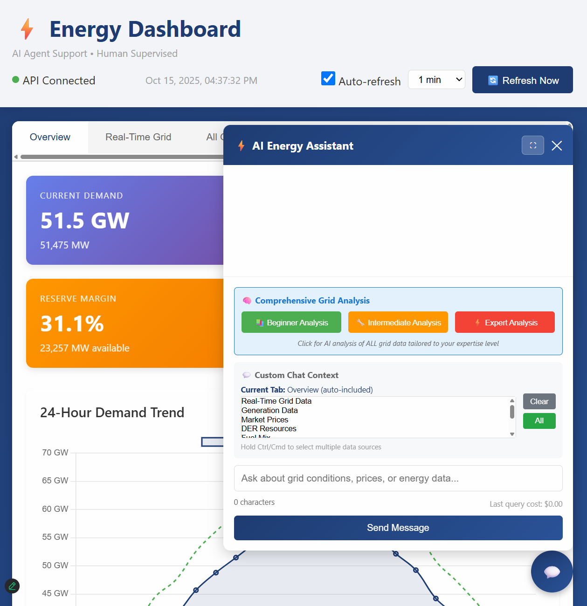

**AI Analysis Interface:**
The chat interface provides three clearly labeled buttons for different expertise levels, making it easy for users to select the appropriate analysis depth for their needs.

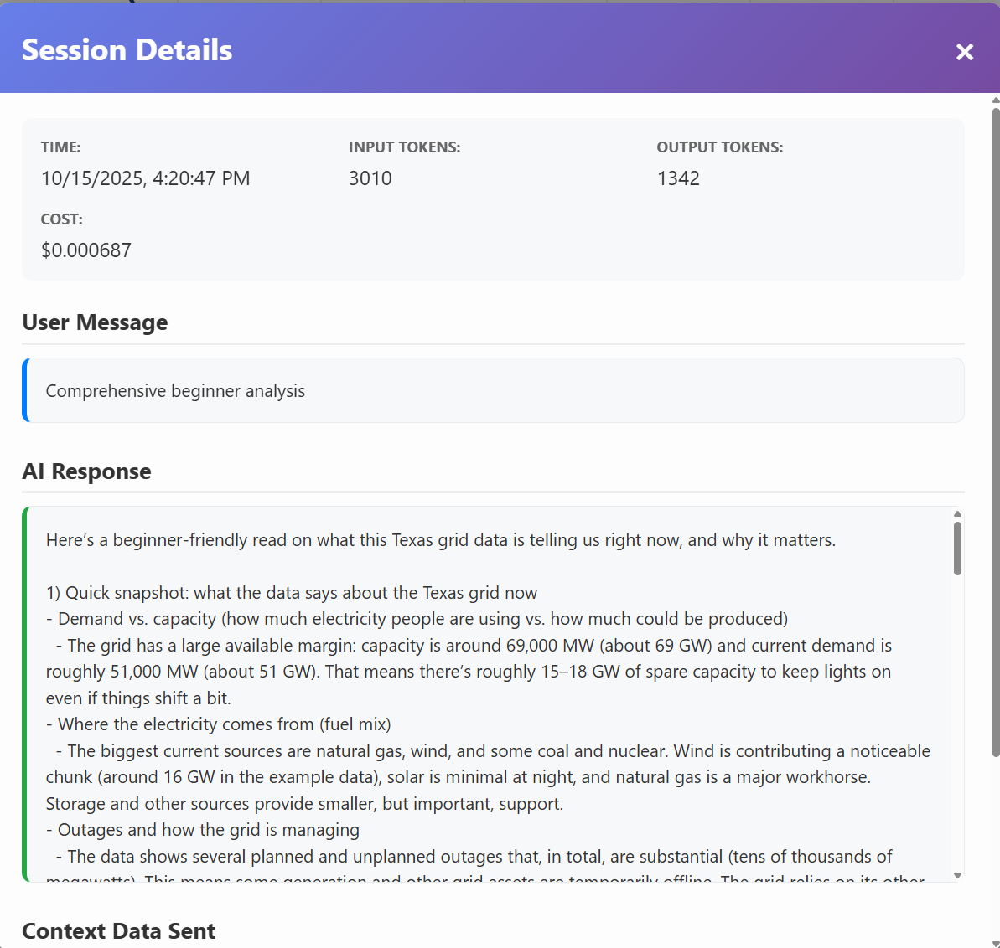

**Example Beginner Analysis Output:**
The AI provides clear, educational explanations such as:
- Current grid capacity vs. demand with easy-to-understand numbers
- Explanation of different electricity generation sources (natural gas, wind, solar, etc.)
- Assessment of grid reliability and available spare capacity
- Simple interpretation of what outages mean for grid operations
- Plain-language summary of current market conditions

**Cost Efficiency:**
- Typical analysis costs: $0.0007 - $0.002 per comprehensive analysis
- Uses 3,000-5,000 tokens depending on data complexity
- Provides extensive insights at minimal cost

## Data Refresh and Updates

- **Automatic Refresh**: Data updates every 5 minutes for real-time accuracy
- **Manual Refresh**: Instant data updates via refresh buttons
- **Error Handling**: Graceful degradation when API services are unavailable
- **Cache Management**: Efficient data caching for improved performance

## Usage Examples

### Monitoring Grid Conditions
1. Navigate to the **Overview** tab for current system status
2. Check **Market Data** tab for pricing trends
3. Use **Generation** tab to understand supply mix
4. Monitor **DER** tab for renewable contribution

### AI-Powered Analysis

#### Comprehensive Grid Analysis (Recommended)
1. Click the **Chat Button** (💬) to open the AI Assistant
2. Choose your expertise level:
   - **📚 Beginner Analysis**: Perfect for learning about energy systems
   - **🔧 Intermediate Analysis**: Great for understanding grid operations
   - **⚡ Expert Analysis**: Detailed technical analysis for professionals
3. Get instant comprehensive analysis of ALL grid data tailored to your level

#### Custom Chat Analysis
1. Open the **AI Assistant** chat interface
2. Select additional data sources from dropdown (optional - current tab included automatically)
3. Ask specific questions like:
   - "What's causing today's price volatility?"
   - "How efficient is wind generation today?"
   - "Compare current demand to seasonal averages"
   - "Explain the current fuel mix and what it means for prices"
4. Review session history and cost tracking in the **AI Cost** tab

## Troubleshooting

### Common Issues
- **API Authentication Errors**: Verify ERCOT credentials in `.env` file
- **Data Not Loading**: Check internet connection and API service status
- **AI Assistant Not Responding**: Verify OpenAI API key configuration
- **Charts Not Displaying**: Ensure JavaScript is enabled in browser

### Support
For technical issues or feature requests, please check the application logs in the browser console or backend server output.

## License

This project is for educational and research purposes. Please ensure compliance with ERCOT API terms of service and OpenAI usage policies.

---

**Note**: This dashboard provides real-time energy market data for informational purposes. Always consult official ERCOT sources for critical operational decisions.